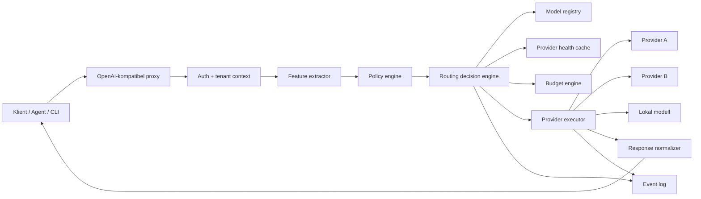

# Systemöversikt

## Översikt

Model-router är en gateway mellan klienter och modellproviders. Den exponerar ett kompatibelt API, analyserar varje request, väljer modell och skickar requesten vidare.

## Huvudkomponenter

### Proxy

Tar emot requests i ett format klienter redan förstår. Prioritet i MVP är `/v1/chat/completions` med stöd för streaming.

### Auth och tenant context

Identifierar tenant, projekt, API key, budget och policyversion.

### Feature extractor

Extraherar snabba signaler:

- Promptlängd.
- Förekomst av kod.
- Filnamn och riskabla domäner.
- Taskord som debug, refactor, summarize, commit, migration.
- Kontextstorlek.
- Begärd outputtyp.
- Metadata från headers eller request body.

### Policy engine

Applicerar regler som kan blockera, tvinga, nedgradera, uppgradera eller kräva verifiering.

### Routing decision engine

Scorar kandidatmodeller och väljer primär modell samt fallbackkedja.

### Provider executor

Skickar requesten till vald provider och normaliserar svar, streaming och fel.

### Event log

Sparar beslut, attempt, kostnad, latency, outcome och policyversion.

## Designprinciper

- Fast path ska inte kräva LLM-call.
- Policyn ska vara kompilerad i minne.
- Modellhälsa ska läsas från cache.
- Fallbackkedja ska vara förberäknad innan provideranrop.
- All routning ska kunna förklaras.
- Det ska gå att simulera routing offline.
