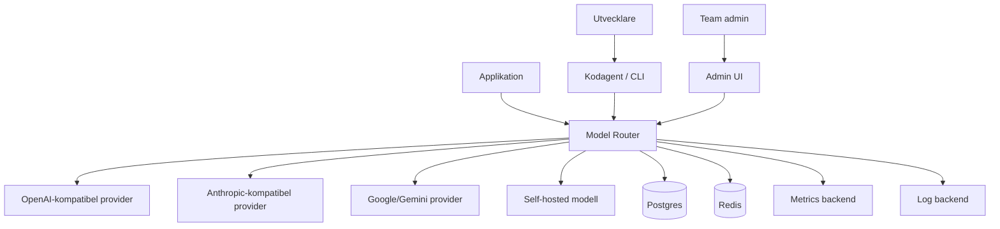

# Kontextdiagram

## Systemkontext



## Externa beroenden

- Modellproviders.
- Betalnings-/kostnadsdata från providers, om tillgängligt.
- Observability stack.
- Secrets manager.
- CI/CD-system för evals och release.

## Gränser

Model-router är ansvarig för:

- Auth.
- Policy.
- Routing.
- Proxying.
- Observability.
- Cost tracking.

Model-router är inte ansvarig för:

- Att garantera sanningshalt i modelloutput.
- Att ersätta applikationens egen auth.
- Att utföra alla agentverktyg.
- Att lagra hela kodbaser om klienten inte skickar kontext.

## Integrationsmönster

### Transparent proxy

Klienten byter endast base URL:

```bash
export OPENAI_BASE_URL="https://router.example.com/v1"
export OPENAI_API_KEY="router_key"
```

### Metadata-aware proxy

Klienten skickar routingmetadata:

```json
{
  "model": "auto",
  "messages": [...],
  "metadata": {
    "task_type": "code_debugging",
    "risk": "high",
    "project": "billing-api"
  }
}
```

### SDK-läge

SDK kan skicka mer signaler än standard-API:

- Aktuell branch.
- Filändringar.
- Teststatus.
- Repo-typ.
- Användarens latency/kvalitetspreferens.
