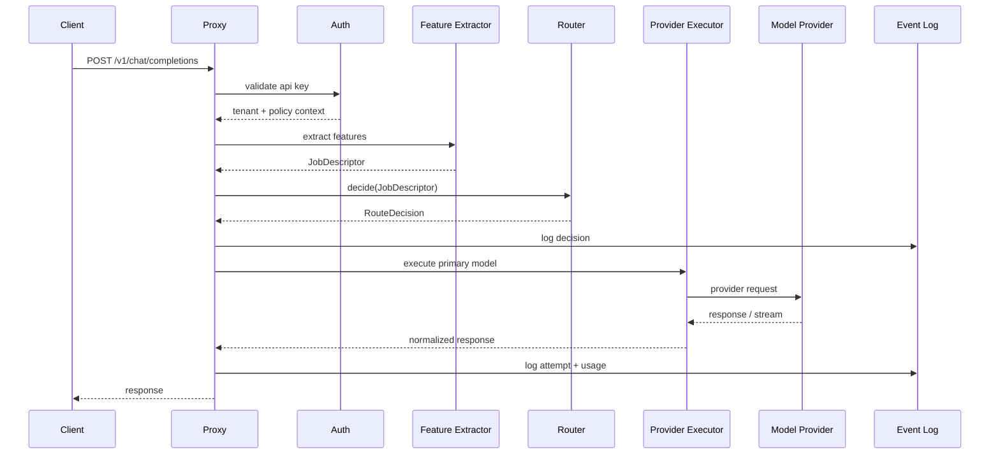

# Request lifecycle

## Lifecycle för en request



## Steg

### 1. Ingress

- Validera JSON.
- Läs headers.
- Extrahera API key.
- Sätt request id.
- Starta tracing span.

### 2. Auth

- Identifiera tenant.
- Kontrollera key status.
- Läs budget och policyversion.
- Sätt begränsningar för model allowlist.

### 3. Feature extraction

Fast path ska vara deterministisk:

- Tokenestimat.
- Prompttyp.
- Riskord.
- Kodsignal.
- Context-size.
- Metadata.
- Explicit override.

### 4. Policy evaluation

Policy kan:

- Blockera request.
- Tvinga modellklass.
- Kräva fallback.
- Kräva verifier.
- Sätta maxkostnad.
- Sätta retention.

### 5. Routing decision

Routern väljer:

- Primär modell.
- Fallbackmodell(er).
- Timeout per attempt.
- Max retries.
- Kontextstrategi.
- Beslutsförklaring.

### 6. Execution

Executor:

- Mappar OpenAI-format till providerformat.
- Skickar request.
- Streamar chunks vid behov.
- Normaliserar fel.
- Mäter tokens och latency.

### 7. Fallback

Fallback triggas vid:

- Timeout.
- Rate limit.
- Provider error.
- Policykrav.
- Verifier failure.

### 8. Response

Response ska inkludera standardfält plus optional routermetadata om klienten tillåter det.

Headers:

```text
x-router-request-id: req_...
x-router-selected-model: premium-reasoning
x-router-policy-version: pv_...
x-router-route-class: high_risk_code
```

## Latencykritiska punkter

- Auth ska cacha API key lookup.
- Policy ska vara precompiled.
- Modellregistry ska ligga i minne.
- Provider health ska läsas från Redis/minne.
- LLM-klassificering får inte användas på fast path.
