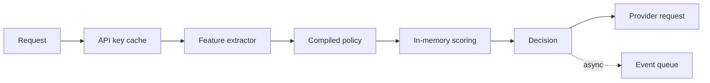

# Low-latency architecture

## Latencymål

| Del | p95 mål |
|---|---:|
| API key validation | < 10 ms med cache |
| Feature extraction | < 20 ms |
| Policy evaluation | < 10 ms |
| Routing score | < 10 ms |
| Decision logging async enqueue | < 5 ms |
| Total router overhead fast path | < 100 ms |

## Grundregel

Routern får inte göra ett extra dyrt modellanrop för att välja modell på varje prompt. Det skulle förstöra latency och kostnadsbesparing.

## Fast path design

Fast path ska vara:

- Deterministisk.
- In-memory.
- Precompiled.
- Cachevänlig.
- Icke-blockerande för loggning.



## Tekniker

### 1. Kompilerade policies

Policyfiler läses från DB eller config, kompileras till effektiv datastruktur och hålls i minne.

### 2. API key cache

API key lookup cacheas med kort TTL. Revoke-händelser invalidar cache.

### 3. Modellregistry i minne

Modellmetadata ska inte hämtas från DB per request.

### 4. Provider health cache

Health score uppdateras asynkront och läses från minne/Redis.

### 5. Async event logging

Skriv inte full logg synkront innan provideranrop. Lägg decision event i kö och flusha senare. För kritiska audit-event kan minimal synkron logg krävas.

### 6. Tokenestimat utan full tokenizer vid behov

För fast path räcker ofta snabb approximation:

```text
estimated_tokens = ceil(char_count / 4)
```

Mer exakt tokenizer kan användas asynkront eller för dyra requests.

### 7. Klassificering utan LLM

Använd rules + lightweight classifier. LLM-classifier endast för:

- Mycket dyra requests.
- Oklara high-risk requests.
- Offline evals.

### 8. Request fingerprint cache

Liknande prompts kan få cached route decision:

```text
fingerprint = hash(normalized_prompt + tenant_policy_version + model_registry_version)
```

Cache TTL bör vara kort och policyversionerad.

## Latencyfällor

- Att slå i DB per request.
- Att invänta komplett loggskrivning.
- Att kalla LLM för klassificering.
- Att göra provider price lookup live.
- Att bygga fallbackkedja efter att timeout redan skett.
- Att normalisera stora streams ineffektivt.

## Rekommenderad implementation

- API-process håller policy och registry i minne.
- Redis används för snabb budget/health/cache.
- Background workers hanterar logs, spend aggregation och health checks.
- Tracing används för att mäta faktisk overhead.
