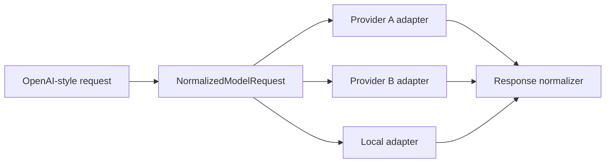

# Provider abstraction

## Syfte

Provider abstraction gör att routern kan tala med olika modellproviders via ett internt standardformat.

## Princip

API:et utåt är OpenAI-kompatibelt. Internt normaliseras requesten till `NormalizedModelRequest`, sedan konverteras den till providerformat.



## Intern request

```json
{
  "messages": [],
  "system": null,
  "temperature": 0.2,
  "max_tokens": 2048,
  "stream": true,
  "tools": [],
  "response_format": null,
  "metadata": {},
  "selected_model": "balanced-coder"
}
```

## Adapteransvar

- Mappa modellnamn.
- Mappa messages/system prompt.
- Mappa tool calls.
- Mappa response format.
- Hantera streamingchunks.
- Normalisera token usage.
- Normalisera fel.

## Feltyper

Interna feltyper:

| Fel | Användning |
|---|---|
| `provider_timeout` | Provider svarar inte inom timeout |
| `provider_rate_limit` | Rate limit eller quota |
| `provider_auth_error` | Fel API key eller provider auth |
| `provider_5xx` | Providerfel |
| `provider_bad_request` | Requestformat fel för provider |
| `model_unavailable` | Modell saknas eller disabled |
| `stream_interrupted` | Stream bröts |

## Streaming

Streaming är svårt eftersom fallback efter påbörjad stream kan vara olämpligt. Rekommendation:

- Fallback före första token: tillåten.
- Fallback efter första token: endast om klienten explicit accepterar restart.
- Logga `first_token_sent=true`.

## Tool calls

Alla modeller stöder inte tool calls lika bra. Registry måste innehålla capability:

```json
{
  "tool_calls": true,
  "parallel_tool_calls": false,
  "json_schema": true
}
```

Routing måste filtrera bort modeller som saknar nödvändigt stöd.
