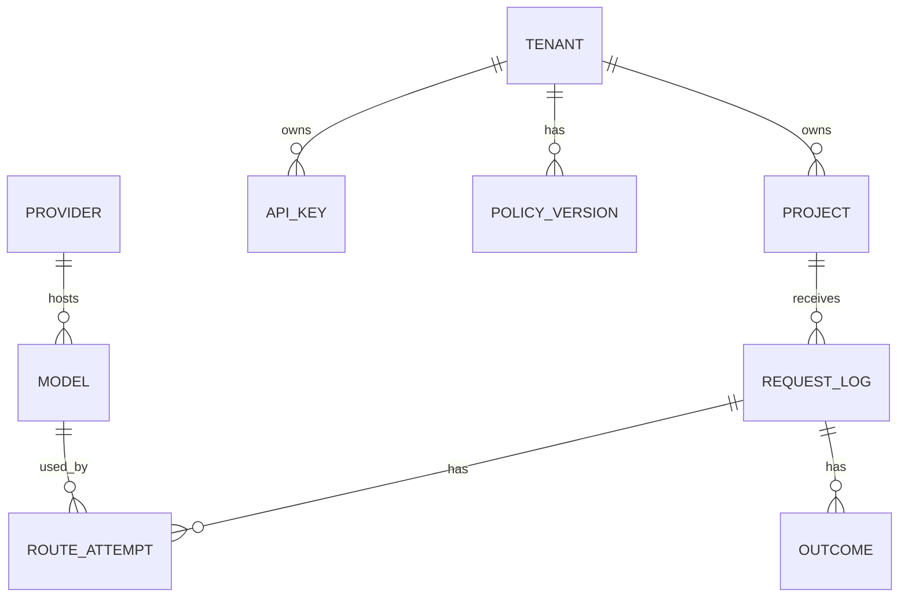

# Datamodell

## Entiteter



## Tabeller

### tenants

- `id`
- `name`
- `created_at`
- `status`
- `retention_days`

### projects

- `id`
- `tenant_id`
- `name`
- `default_policy_version_id`
- `created_at`

### api_keys

- `id`
- `tenant_id`
- `project_id`
- `key_hash`
- `name`
- `scopes`
- `status`
- `created_at`
- `last_used_at`

### providers

- `id`
- `name`
- `status`
- `base_url`
- `auth_secret_ref`

### models

- `id`
- `provider_id`
- `provider_model_id`
- `tier`
- `capabilities_json`
- `cost_json`
- `quality_scores_json`
- `enabled`

### policy_versions

- `id`
- `tenant_id`
- `project_id`
- `version`
- `policy_json`
- `created_at`
- `activated_at`
- `status`

### request_logs

- `id`
- `tenant_id`
- `project_id`
- `api_key_id`
- `route_class`
- `job_descriptor_json`
- `selected_model_id`
- `selected_provider_id`
- `policy_version_id`
- `router_version`
- `estimated_input_tokens`
- `estimated_output_tokens`
- `actual_input_tokens`
- `actual_output_tokens`
- `estimated_cost_usd`
- `actual_cost_usd`
- `router_overhead_ms`
- `provider_latency_ms`
- `status`
- `created_at`

### route_attempts

- `id`
- `request_log_id`
- `attempt_index`
- `model_id`
- `provider_id`
- `timeout_ms`
- `status`
- `error_type`
- `first_token_ms`
- `total_latency_ms`
- `input_tokens`
- `output_tokens`
- `cost_usd`
- `created_at`

### outcomes

- `id`
- `request_log_id`
- `outcome_type`
- `value`
- `source`
- `metadata_json`
- `created_at`

Exempel `outcome_type`:

- `accepted`
- `rejected`
- `test_passed`
- `test_failed`
- `user_regenerated`
- `manual_override`
- `verifier_failed`

## Minimal SQL-skiss

```sql
create table tenants (
  id text primary key,
  name text not null,
  status text not null default 'active',
  retention_days integer not null default 30,
  created_at timestamptz not null default now()
);

create table request_logs (
  id text primary key,
  tenant_id text not null references tenants(id),
  project_id text,
  route_class text,
  selected_model_id text,
  policy_version_id text,
  job_descriptor_json jsonb not null,
  router_overhead_ms integer,
  provider_latency_ms integer,
  actual_cost_usd numeric(12,6),
  status text not null,
  created_at timestamptz not null default now()
);
```

## Retention

- Promptinnehåll ska kunna stängas av i loggar.
- Metadata och routingbeslut kan sparas längre än prompttext.
- Secrets ska maskas före persistent lagring.
- Enterprise-läge bör ha per-tenant retention.
