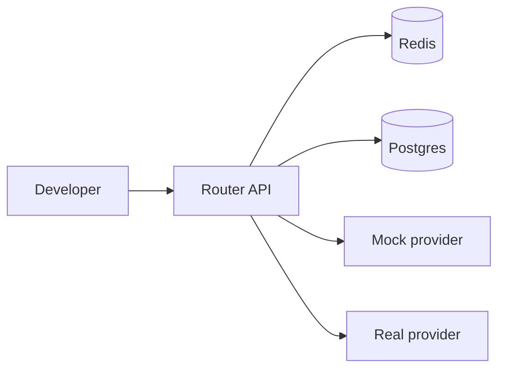
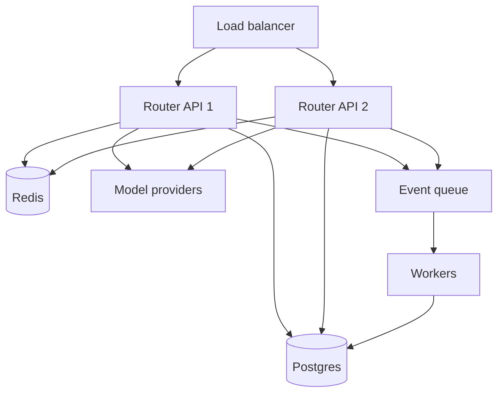

# Deployment topology

## Lokal utveckling

Komponenter:

- Router API.
- Worker.
- Postgres.
- Redis.
- Mock provider för tester.

## MVP produktion

## Skalningsprinciper

- API-noder ska vara stateless.
- Policy och registry laddas vid startup och kan hot-reloadas.
- Redis används för snabb state.
- Workers hanterar icke-kritiska jobb.
- Eventqueue skyddar API-latency.

## Regioner

MVP kan köras i en region. Team/enterprise bör överväga:

- Region per tenant.
- Providerregioner.
- Data residency.
- Regional failover.

## Kapacitet

Dimensionera för:

- Peak RPS.
- Streaming-connection count.
- Provider rate limits.
- Event queue backlog.
- Dashboard query load.

## Rollout

1. Intern dogfood.
2. Shadow mode.
3. 10 procent traffic.
4. Full beta.
5. Production hardening.

## Blue/green policy deploy

Policy bör deployas separat från kod:

- Skapa ny policyversion.
- Simulera mot evals.
- Aktivera för intern tenant.
- Aktivera för pilotprojekt.
- Aktivera globalt.
