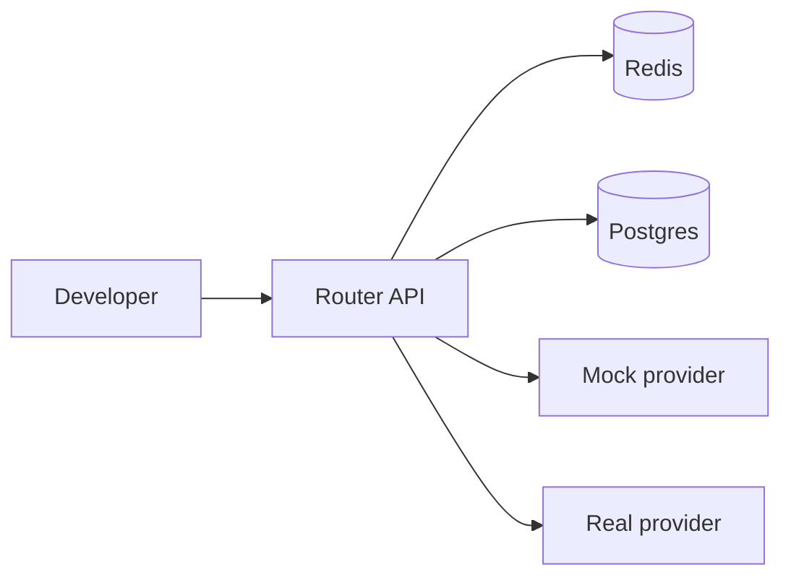
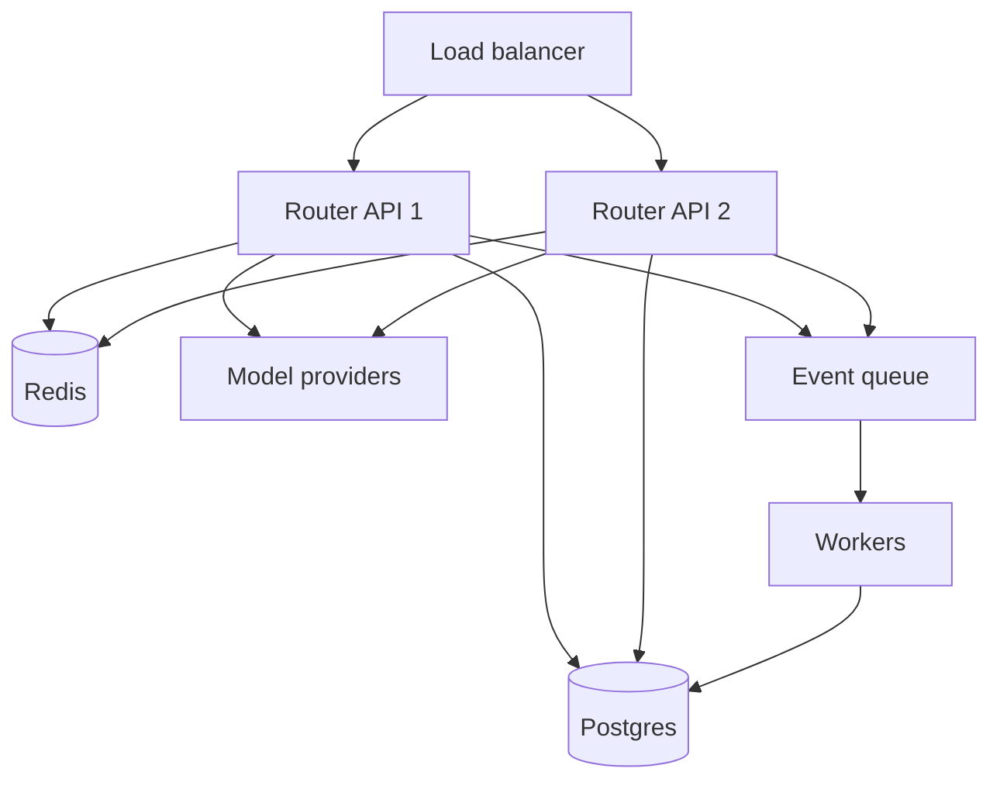

# Deployment topology

## Lokal utveckling



Komponenter:

- Router API.
- Worker.
- Postgres.
- Redis.
- Mock provider för tester.

## MVP produktion



## Skalningsprinciper

- API-noder ska vara stateless.
- Policy och registry laddas vid startup och kan hot-reloadas.
- Redis används för snabb state.
- Workers hanterar icke-kritiska jobb.
- Eventqueue skyddar API-latency.

## Regioner

MVP kan köras i en region. Team/enterprise bör överväga:

- Region per tenant.
- Providerregioner.
- Data residency.
- Regional failover.

## Kapacitet

Dimensionera för:

- Peak RPS.
- Streaming-connection count.
- Provider rate limits.
- Event queue backlog.
- Dashboard query load.

## Rollout

1. Intern dogfood.
2. Shadow mode.
3. 10 procent traffic.
4. Full beta.
5. Production hardening.

## Container deploy (Docker / EasyPanel / any PaaS)

The router runs as a **single self-contained container** — it needs no database
to boot (in-memory trackers; the provider is reached over HTTPS), so the
`Dockerfile` at the repo root is a complete deployment. The image is a static Go
binary on Alpine (~32 MB) running as non-root, with a `/healthz` healthcheck.

```bash
docker build -t tokenizer-router .
docker run -p 8080:8080 \
  -e LOCAL_API_KEY=<strong-secret> \
  -e OPENROUTER_API_KEY=<sk-or-...> \
  tokenizer-router
```

**EasyPanel (or similar Git-driven PaaS):**

1. Create an **App** → source = this GitHub repo → build = **Dockerfile** (path `./Dockerfile`).
2. Paste env vars in the UI (see `.env.example`). Minimum for a real provider:
   - `LOCAL_API_KEY` — a **strong secret** clients send as `Authorization: Bearer …` (never the dev default `local_router_key`).
   - `OPENROUTER_API_KEY` — routes through OpenRouter; omit to fall back to the mock provider.
   - Optional: `ROUTER_BUDGET_USD` (spend cap), `ROUTER_RETENTION_DAYS`, `ROUTER_CONSERVATIVE_MODE`, etc.
3. Expose container port **8080**; point the platform healthcheck at `GET /healthz`.
4. Point any OpenAI-compatible client at `https://<your-domain>/v1` with `model: "auto"`.

Notes:
- **No Postgres/Redis required** for the router itself; add them only if/when persistent request logs or cross-restart spend are wired in.
- Secrets live in the platform's env UI, never in the image — `.dockerignore` excludes `.env`.

## Blue/green policy deploy

Policy bör deployas separat från kod:

- Skapa ny policyversion.
- Simulera mot evals.
- Aktivera för intern tenant.
- Aktivera för pilotprojekt.
- Aktivera globalt.
