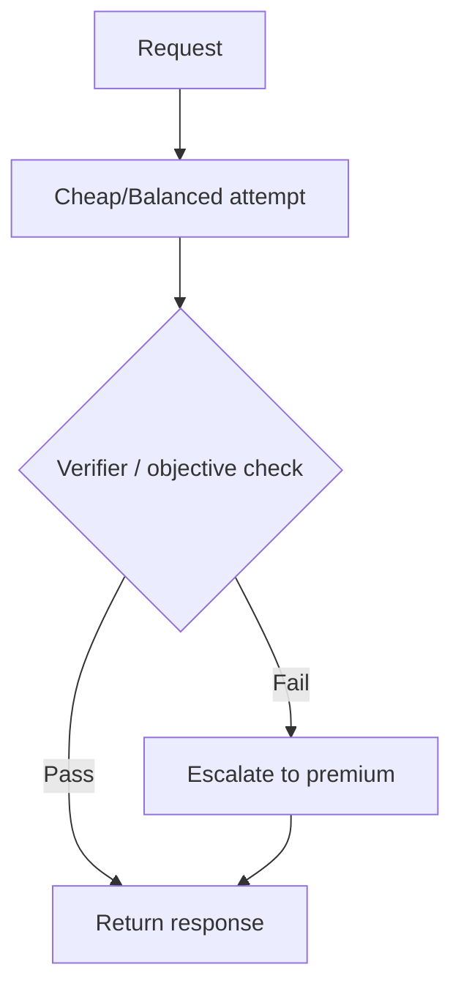

# Verifier och escalation

## Syfte

Verifiering och eskalering minskar risken när billigare modell används.

## Cascade

## När verifier behövs

- Security review.
- Database migration.
- Auth/payment-kod.
- Produktion nämns.
- Hög diff-risk.
- Låg classifier confidence.
- Användaren begär `requires_verifier`.

## Verifiermetoder

### Objektiva checks

- Tests pass/fail.
- Typecheck.
- Lint.
- JSON schema validation.
- SQL dry-run.

### LLM verifier

- Kontrollera att svaret följer instruktion.
- Kontrollera risker.
- Kontrollera hallucinerade APIs.

### Human verifier

Enterprise eller high-risk workflows kan kräva approval.

## Escalation triggers

- Verifier failed.
- Provider timeout.
- Low confidence.
- User feedback rejected.
- Policy requires premium after failed cheap attempt.

## Kostnadskontroll

Verifiering kan bli dyrare än att välja premium direkt. För high-risk tasks kan route direkt till premium vara billigare totalekonomiskt.

## Beslutsregel

Använd cascade främst när:

- Tasken ofta är enkel men ibland svår.
- Billig modell har hög pass rate.
- Verifieringen är billig eller objektiv.

Routea direkt till premium när:

- Fel är dyrt.
- Verifier är dyrt.
- Tasken är komplex från start.
